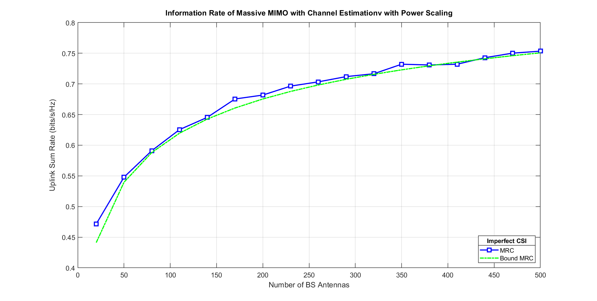
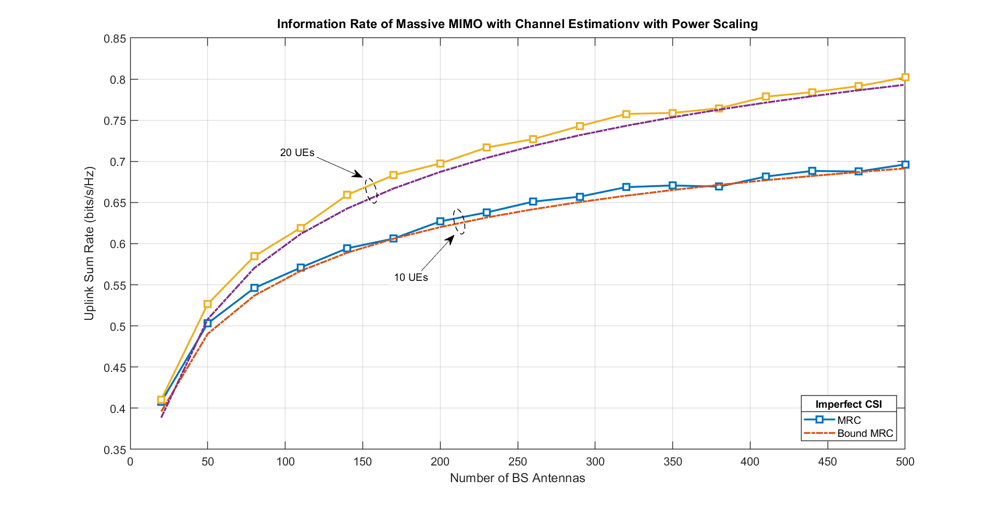

# Information-Rate-of-mmWave-Massive-MIMO-System
## Perfect CSI 

- Problem Statements: Simulate a mmWave Massive MIMO wireless system in MATLAB for perfect CSI assumtion for K = 10 Single antenna users. Generate uplink sum rate for both MRC and ZF receivers and show how no of antennas at BS impacts information rate in Infomation vs No of antennas curve. 

- Simulation:

Large scale fading co-efficient for user $k$ is defined as - 
$$\beta_k = \frac{||\bar{h}_k||^2}{r}$$
Where $r$ is total no. of BS antennas.

So, as the no. of BS antennas $r$ is large or tends to $\infty$, channel is behaving as less and less fluctuating or we can say less and less fading, is nothing but Channel Hardenning. 

Now if decrease power as - 
$$P_k = \frac{E_k}{r}$$

- Problem Statement:

- Simulation:

## Imperfect CSI:

- Problem Statement:

- Simulation: 

- Problem Statement:

- Simulation: 

- Problem Statement:

- Simulation: 

